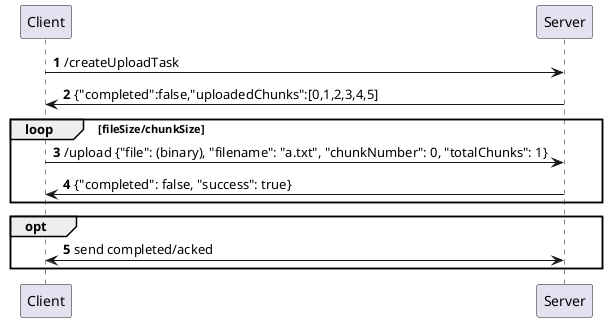

# 大文件传输方案

## 大文件传输考虑的问题

### 网络限制

传输速度：文件越大，传输时间越长，尤其在低带宽或高延迟网络中表现明显。
网络中断：大文件传输过程中，网络的不稳定（如超时、丢包）可能导致传输失败，需要重新开始。
带宽占用：大文件传输可能占用大量带宽，影响其他任务的正常运行。
跨网络传输：不同的网络环境（如企业内网与公网）可能有防火墙、代理或限速限制。

### 系统与硬件限制

内存不足：如果需要将大文件加载到内存中处理，可能导致内存溢出（OutOfMemoryError）。
磁盘性能：大文件的读写操作对磁盘 I/O 是一个挑战，尤其是在磁盘性能较差或并发读写多的情况下。
文件系统限制：某些文件系统对单个文件大小有上限（如 FAT32 的单文件大小限制为 4GB）。磁盘空间不足可能导致文件传输失败。

### 数据完整性

文件损坏：网络传输中的数据丢失或错误可能导致接收端文件不完整或损坏。
校验困难：大文件的完整性校验（如 MD5、SHA-256）耗时较长。

### 并发与多用户冲突

多用户竞争资源：多个用户同时上传或下载大文件时，可能导致服务器资源不足（CPU、内存、I/O 等）。
锁机制：大文件传输可能需要锁定部分资源，影响系统性能。

### 应用层面的问题

超时问题：大文件传输时间较长，可能超过默认的连接超时时间。
传输失败后的重试：一旦传输中断，重新传输整个文件可能浪费大量时间和带宽。
兼容性：跨平台传输时，文件格式、编码或路径可能存在不兼容问题。

## 传输技术方案

### 分段传输

将文件分成小块（如 1MB、10MB），逐块进行传输。

避免大文件读取占用大量内存减少。网络中断或异常时，仅需重新传输未完成的部分，而非整个文件。

### 断点续传

在传输中断时记录传输进度，重新连接后从中断点继续。

客户端和服务端共同维护文件传输的偏移量（offset）。

### 校验完整性

传输完成后，通过校验和（如 MD5 或 SHA-256）验证文件完整性。

优化方式：在传输过程中按块计算校验和，避免传输完成后才校验整个文件。

## 实现方案



查看文件之前是否已经传输过

```json
// request
{ 
    "filename": "a.txt",    // 文件名
}

// response
{ 
    "completed": false,    // 是否传输完成
    "uploadedChunks":[0,1,2,3,4,5] // 已经传输完成的切片
}
```

上传文件，拆分为一个个分片传输

```json
{
    "filename": "a.txt",    // 文件名
    "file": "binary",       // 切片二进制
    "curChunk": 0,          // 当前传输的切片
    "totalChunks": 5,       // 总切片数量
    "md5": "xxxxx"          // 文件标识，检验完整性
}
```

通知服务器文件传输结束

```json
{
    "filename": "a.txt",    // 文件名
    "completed": true       // 传输完成
}
```

客户端

定义好切片大小，将文件分成一个个切片，逐分片进行传输。前端开启多线程进行传输？

1. 定义切片大小，对文件进行切分
2. 请求服务器获取当前文件传输状态（服务器已接收的切片）
3. 所有切片传输给服务器，跳过服务器已接收的切片

服务器

接受前端传输的切片，接受到所有的切片后，合并所有的切片为文件

1. 创建临时目录保存客户端上传的切片
2. 传输完成后，合并所有切片
   1. 前端指示总切片数据，判断当完成的切片数量等于总数量时，进行合并
   2. 前端发送完所有切片后，通知服务器进行合并